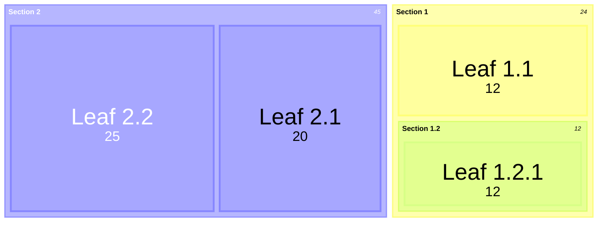
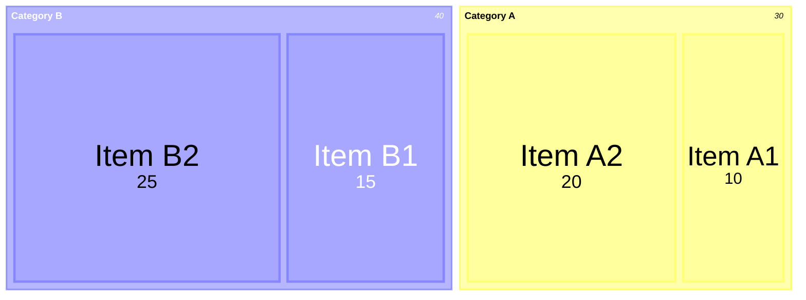
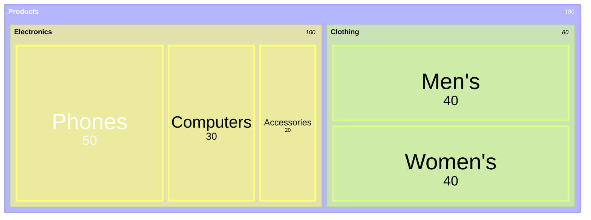
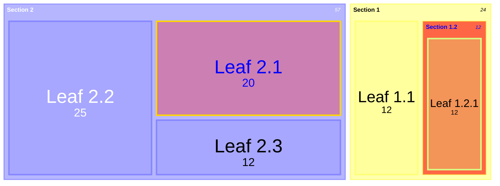
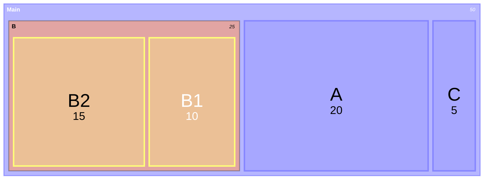
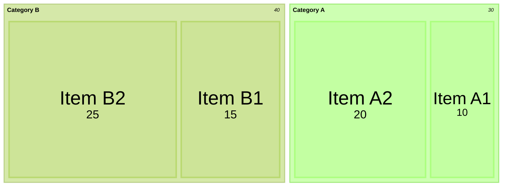
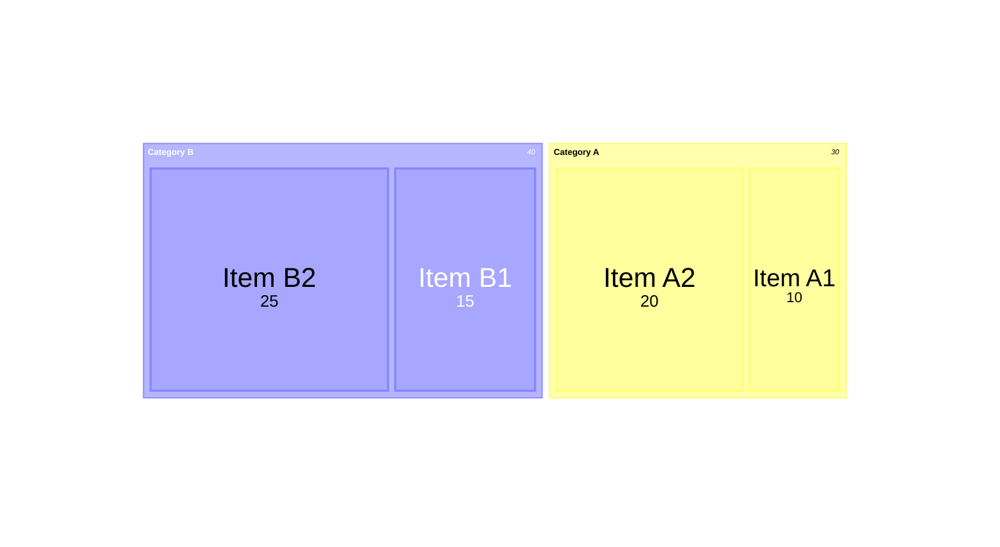
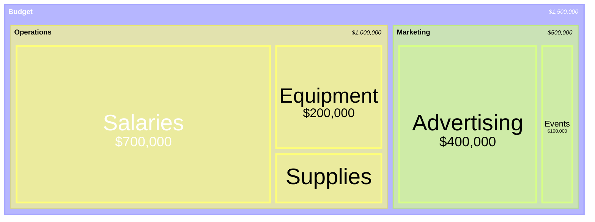
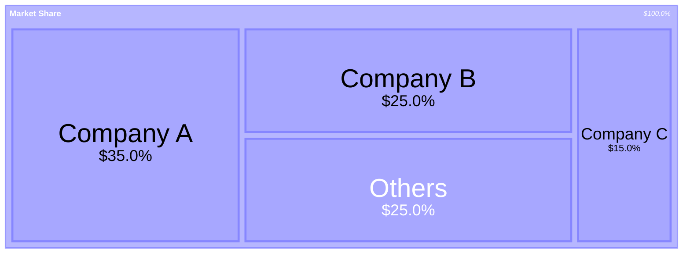

# Mermaid Treemap Diagram Documentation

> **NOTE**  
> The treemap diagram is a **beta** feature in Mermaid.  
> Its syntax may change in future releases.

---

## 1. Overview

A **treemap** visualises hierarchical data as a set of nested rectangles.  
Each node’s rectangle size is proportional to its numeric value, making it easy to compare parts of a hierarchy.

Typical use‑cases:

| Use‑case | Example |
|---------|--------|
| Budget allocation | <code>Budget → Operations → Salaries: 700000</code> |
| File‑system usage | <code>Root → Folder → File: 12345</code> |
| Market share | <code>Company A: 0.35</code> |

---

## 2. Syntax

### 2.1 Node Definition

| Node type | Syntax | Example |
|----------|-------|--------|
| **Section / Parent** | `"Section Name"` | `"Products"` |
| **Leaf** | `"Leaf Name": value` | `"Phones": 50` |
| **Indentation** | Spaces or tabs | 4 spaces per level |
| **Styling** | `:::className` | `"Section 1.2":::class1` |

---

## 3. Examples

### 3.1 Basic Treemap

### 3.2 Hierarchical Treemap

### 3.3 Treemap with Styling

---

## 4. Styling & Configuration

### 4.1 `classDef` for Styling

### 4.2 Theme Configuration

### 4.3 Diagram Padding

---

## 5. Configuration Options

| Option | Description | Default |
|-------|------------|--------|
| `useMaxWidth` | Set diagram width to 100% | `true` |
| `padding` | Internal padding between nodes | `10` |
| `diagramPadding` | Padding around the entire diagram | `8` |
| `showValues` | Show numeric values | `true` |
| `nodeWidth` | Width of nodes | `100` |
| `nodeHeight` | Height of nodes | `40` |
| `borderWidth` | Border width | `1` |
| `valueFontSize` | Font size for values | `12` |
| `labelFontSize` | Font size for labels | `14` |
| `valueFormat` | Format for values | `','` |

---

## 6. Advanced Features

### 6.1 Value Formatting

`valueFormat` uses D3 format specifiers. Common patterns:

| Pattern | Meaning |
|--------|--------|
| `,` | Thousands separator (default) |
| `$` | Dollar sign |
| `.1f` | One decimal place |
| `.1%` | Percentage with one decimal |
| `$0,0` | Dollar sign + thousands separator |
| `$.2f` | Dollar sign + 2 decimals |
| `$,.2f` | Dollar sign + thousands separator + 2 decimals |

#### Example – Currency Formatting

#### Example – Percentage Formatting

---

## 7. Common Use Cases

| Domain | Example |
|-------|--------|
| **Finance** | Budget allocations, portfolio composition |
| **File Systems** | Disk space usage |
| **Demographics** | Population distribution |
| **Products** | Sales volumes by category |
| **Org Structure** | Departments & team sizes |

---

## 8. Limitations

- Best suited for data with a natural hierarchy.  
- Very small values may be hard to see or label.  
- Deep hierarchies can become cluttered.  
- Negative values are not supported.

---

## 9. Alternatives

| Diagram | When to Use |
|--------|------------|
| **Pie Chart** | Simple proportions, no hierarchy |
| **Sunburst** | Radial hierarchical view (future release) |
| **Sankey** | Flow‑based hierarchical data |

---

## 10. Feedback & Contributions

This treemap implementation is still evolving.  
Feel free to open issues or pull requests on the [Mermaid GitHub repository](https://github.com/mermaid-js/mermaid).

---