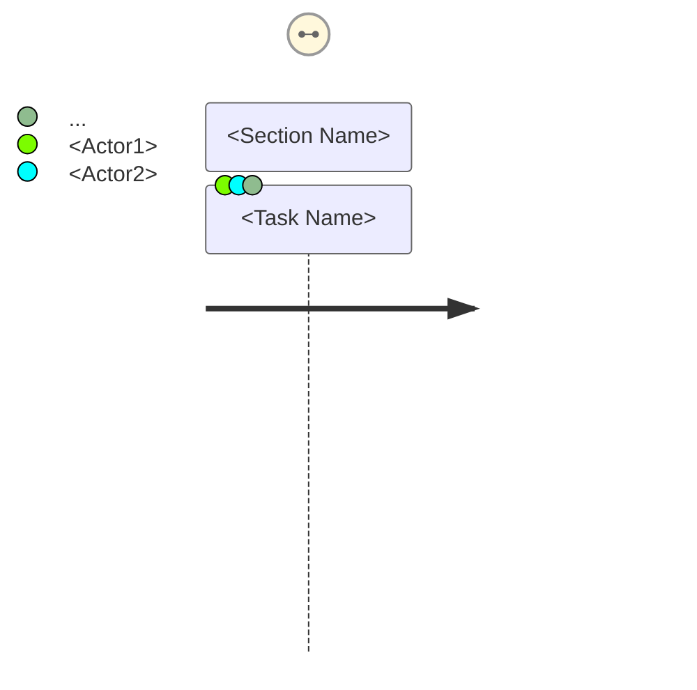
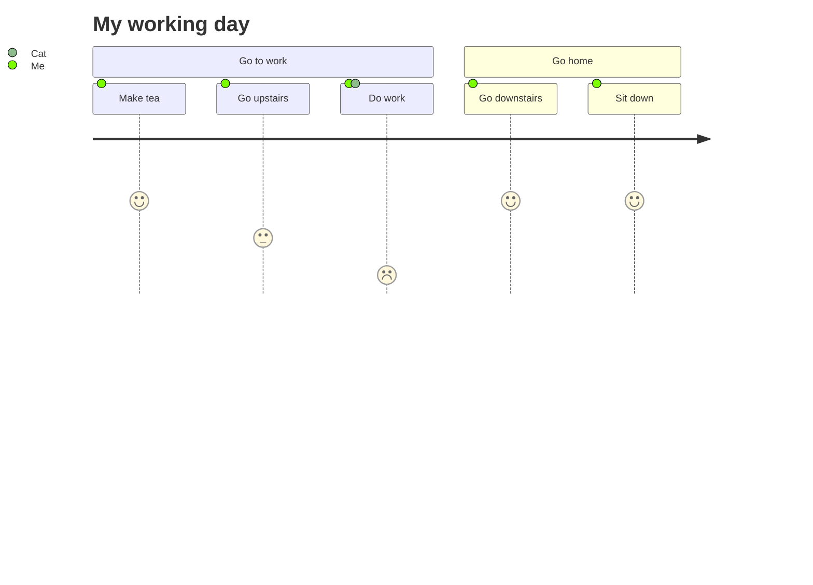

# Mermaid User Journey Diagram

Mermaid can render **User Journey** diagrams, which describe the high‑level steps that different users (or actors) take to complete a specific task within a system, application, or website.  
The diagram shows the current (as‑is) workflow and can help identify areas for improvement.

---

## Syntax



* **title** – The title of the journey.  
* **section** – A logical grouping of tasks.  
* **Task Name** – The name of the activity.  
* **Score** – A numeric value (typically 1–5) indicating the effort or importance.  
* **Actors** – Comma‑separated list of people or entities performing the task.

---

## Example



**Rendered Diagram**

```
Cat
Me
Go to work
Make tea
Go upstairs
Do work
Go home
Go downstairs
Sit down
My working day
```

---

## Notes

* Each **section** groups related tasks.  
* The **score** can be used to highlight priority or effort.  
* Actors can be any identifier (e.g., `Me`, `Cat`, `Admin`, etc.).  

Feel free to adjust the titles, sections, tasks, scores, and actors to match your own workflow.