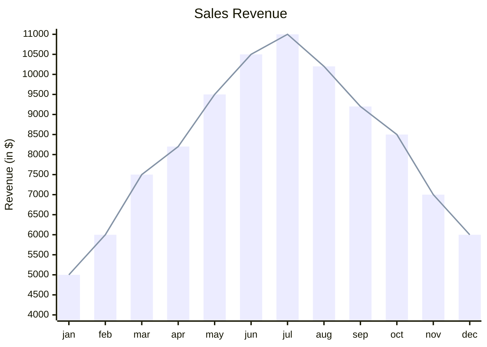
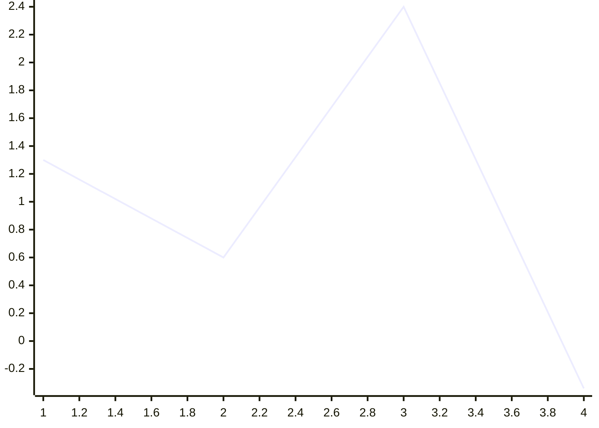
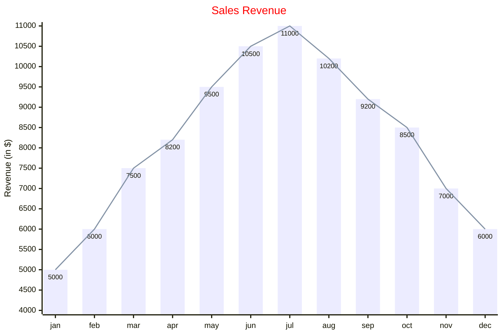

# Mermaid XY Chart Documentation

> **Note** – The XY Chart module (`xychart-beta`) is a part of the Mermaid‑JS charting suite.  
> It currently supports **bar** and **line** charts that use both an X‑axis and a Y‑axis.  
> The syntax below is the canonical way to declare an XY chart in Mermaid.

---

## 1. Basic Syntax



> **Run** → `Ctrl + Enter` (or click the ▶ button) to render the chart.

---

## 2. Chart Configuration

| Parameter | Description | Default |
|----------|------------|--------|
| `width` | Width of the chart | `700` |
| `height` | Height of the chart | `500` |
| `titlePadding` | Top & bottom padding of the title | `10` |
| `titleFontSize` | Font size of the title | `20` |
| `showTitle` | Show title? | `true` |
| `xAxis` | X‑axis configuration (`AxisConfig`) | – |
| `yAxis` | Y‑axis configuration (`AxisConfig`) | – |
| `chartOrientation` | `'vertical'` or `'horizontal'` | `'vertical'` |
| `plotReservedSpacePercent` | Minimum space plots occupy | `50` |
| `showDataLabel` | Show numeric value inside bars | `false` |

### AxisConfig

| Parameter | Description | Default |
|----------|------------|--------|
| `showLabel` | Show axis labels or tick values | `true` |
| `labelFontSize` | Font size of the label | `14` |
| `labelPadding` | Top & bottom padding of the label | `5` |
| `showTitle` | Show axis title? | `true` |
| `titleFontSize` | Font size of the axis title | `16` |
| `titlePadding` | Top & bottom padding of the axis title | `5` |
| `showTick` | Show tick marks? | `true` |
| `tickLength` | Length of tick marks | `5` |
| `tickWidth` | Width of tick marks | `2` |
| `showAxisLine` | Show axis line? | `true` |
| `axisLineWidth` | Thickness of the axis line | `2` |

---

## 3. Chart Orientation

```mermaid
xychart-beta horizontal
    ...
```

> Default orientation is **vertical**.

---

## 4. Title

```mermaid
xychart-beta
    title "This is a simple example"
    ...
```

> If the title is a single word, quotes are optional.  
> If it contains spaces, enclose it in double quotes.

---

## 5. Axes

### X‑Axis

```mermaid
x-axis [jan, feb, mar, apr, may, jun, jul, aug, sep, oct, nov, dec]
```

* **Categorical** – list of categories (text).  
* **Numeric** – specify a range: `x-axis "Months" 1 --> 12`.

### Y‑Axis

```mermaid
y-axis "Revenue (in $)" 4000 --> 11000
```

* Must be numeric.  
* Title is optional; if omitted, the range is auto‑generated from data.

---

## 6. Chart Types

### Line Chart

```mermaid
line [2.3, 45, .98, -3.4]
```

### Bar Chart

```mermaid
bar [2.3, 45, .98, -3.4]
```

---

## 7. Simplest Example



Only the chart name and one data set are required.

---

## 8. Theme Variables

Themes are scoped under `xyChart`. Example:

```yaml
---
config:
  themeVariables:
    xyChart:
      titleColor: '#ff0000'
---
```

| Variable | Description |
|---------|------------|
| `backgroundColor` | Whole chart background |
| `titleColor` | Title text color |
| `xAxisLabelColor` | X‑axis label color |
| `xAxisTitleColor` | X‑axis title color |
| `xAxisTickColor` | X‑axis tick color |
| `xAxisLineColor` | X‑axis line color |
| `yAxisLabelColor` | Y‑axis label color |
| `yAxisTitleColor` | Y‑axis title color |
| `yAxisTickColor` | Y‑axis tick color |
| `yAxisLineColor` | Y‑axis line color |
| `plotColorPalette` | Comma‑separated color string (e.g. `"#f3456, #43445"`) |

---

## 9. Full Example with Config & Theme



> **Run** → `Ctrl + Enter` to render.

---

## 10. Summary

* **Chart name**: `xychart-beta`  
* **Required**: chart name + at least one data set (`line` or `bar`)  
* **Optional**: title, axes, orientation, config, theme variables  
* **Supported chart types**: bar, line (future expansion possible)

Happy charting with Mermaid!