# ZenUML Sequence Diagram Documentation

> **Note** – This guide focuses on the ZenUML syntax for Mermaid sequence diagrams.  
> All examples shown below are fully functional and can be copied into a Mermaid‑enabled editor.

---

## 1. Overview

ZenUML is a Mermaid extension that renders sequence diagrams using a concise, code‑centric syntax.  
Unlike Mermaid’s native sequence diagram syntax, ZenUML uses a different, more compact language.

---

## 2. Syntax Basics

### 2.1 Participants

Participants (actors, objects, etc.) are declared implicitly by the first appearance of a name.  
If you want to control the order of appearance, declare them explicitly:

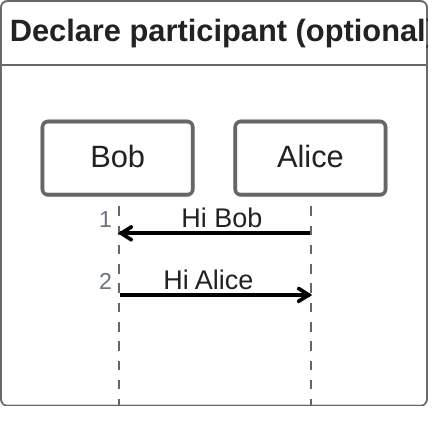

### 2.2 Annotators

Use annotators to give participants a specific shape or icon:

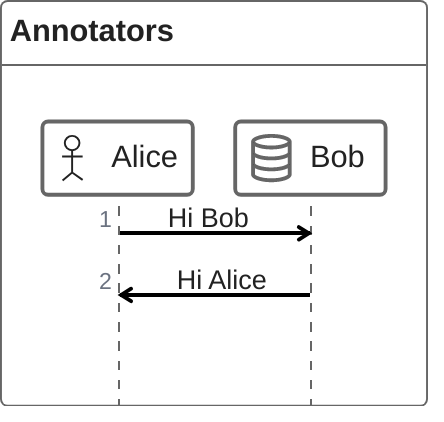

Available annotators include `@Actor`, `@Database`, etc. (See Mermaid docs for the full list.)

### 2.3 Aliases

Give a participant a short identifier and a descriptive label:

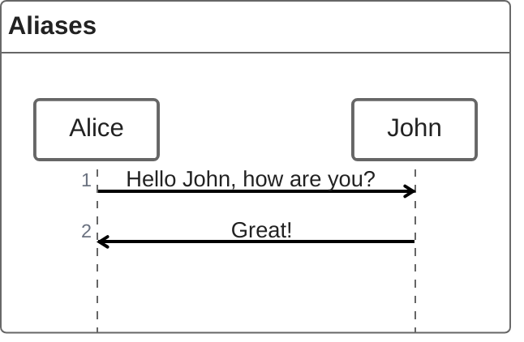

---

## 3. Messages

ZenUML supports several message types:

| Type | Syntax | Example |
|------|-------|--------|
| **Sync message** | `A.SyncMessage` | `A.SyncMessage` |
| **Async message** | `Alice->Bob: How are you?` | `Alice->Bob: How are you?` |
| **Creation message** | `new A1` | `new A1` |
| **Reply message** | `a = A.SyncMessage()` | `a = A.SyncMessage()` |

### 3.1 Sync Message

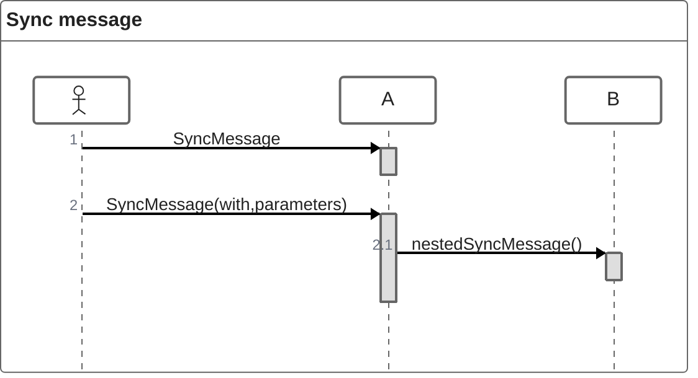

### 3.2 Async Message

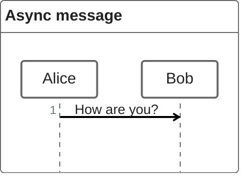

### 3.3 Creation Message

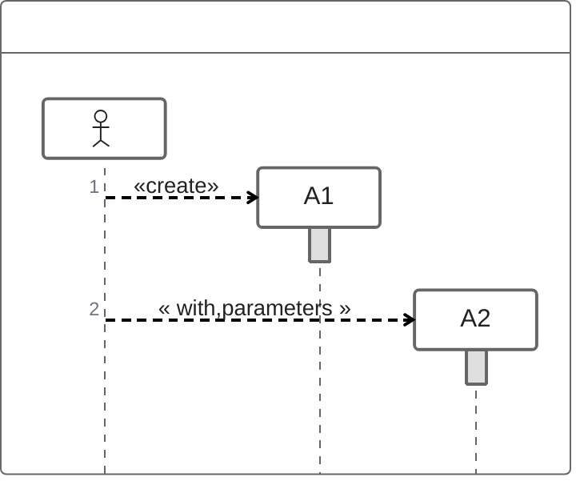

### 3.4 Reply Message

Three ways to express a reply:

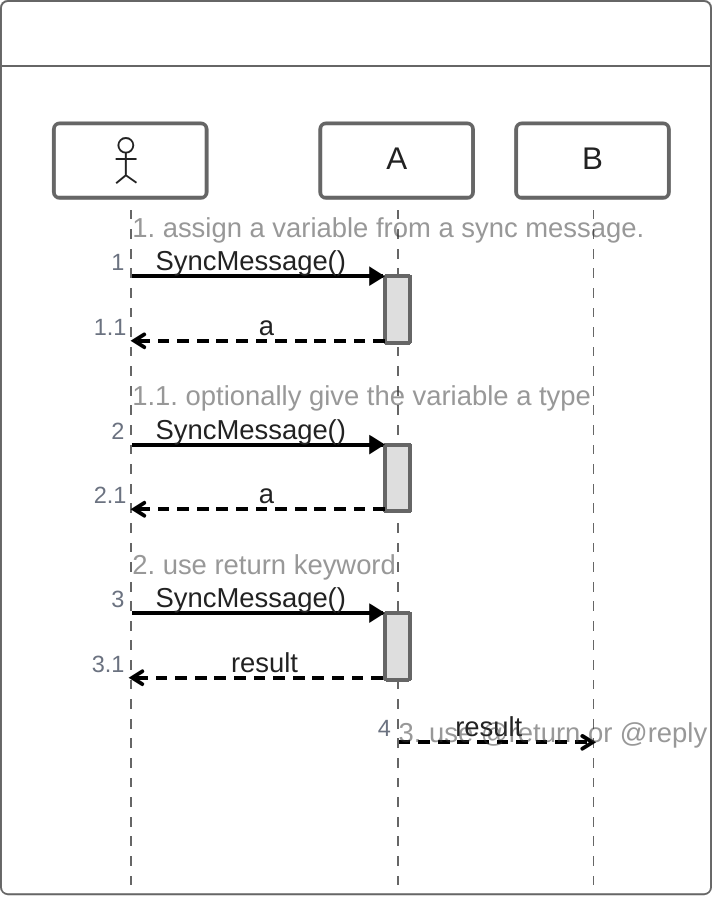

---

## 4. Control Flow

### 4.1 Nesting

Sync and creation messages can be nested with `{}`:

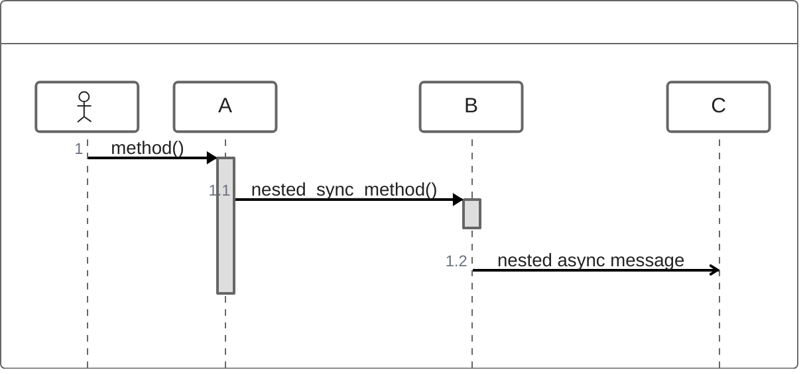

### 4.2 Comments

Add comments with `//`. Markdown is supported:

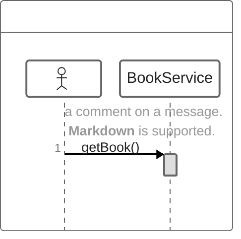

### 4.3 Loops

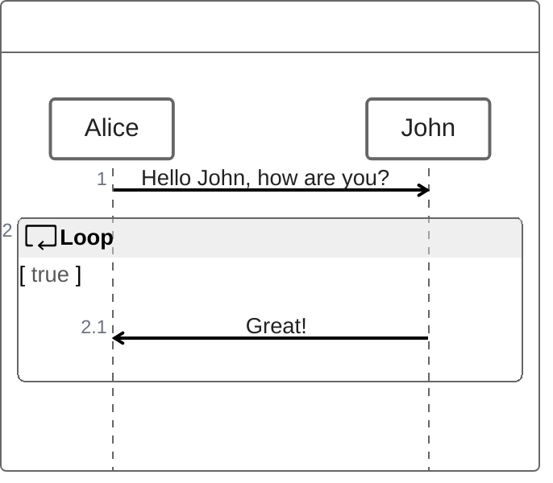

### 4.4 Alternatives (Alt)

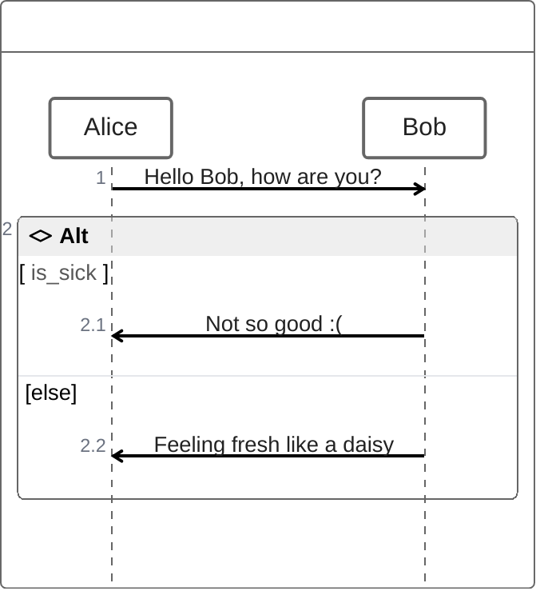

### 4.5 Optional (Opt)

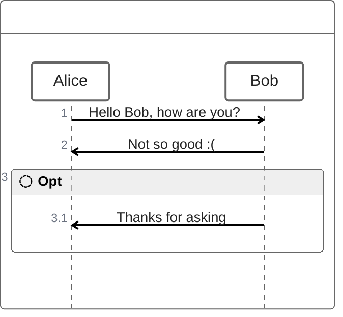

### 4.6 Parallel

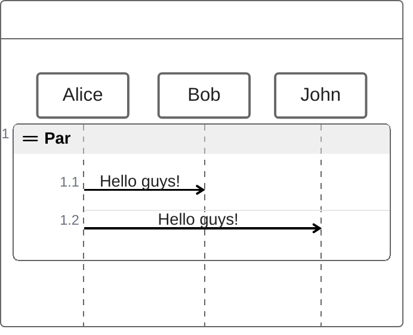

### 4.7 Try/Catch/Finally (Break)

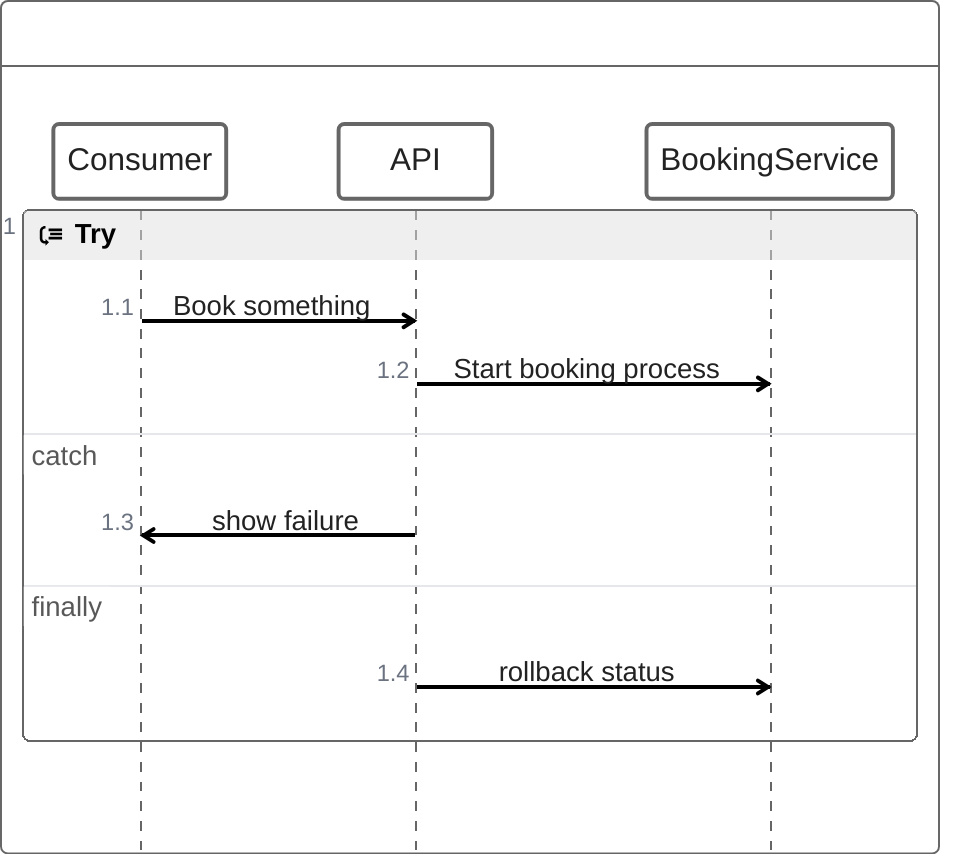

---

## 5. Integration with Web Pages

ZenUML uses experimental lazy loading & async rendering.  
Add Mermaid and ZenUML to a page like this:

```html
<script type="module">
  import mermaid from 'https://cdn.jsdelivr.net/npm/mermaid@10/dist/mermaid.esm.min.mjs';
  import zenuml from 'https://cdn.jsdelivr.net/npm/@mermaid-js/mermaid-zenuml@0.1.0/dist/mermaid-zenuml.esm.min.mjs';
  await mermaid.registerExternalDiagrams([zenuml]);
</script>
```

---

## 6. Summary

- **Participants**: implicit or explicit declaration.
- **Annotators**: give visual meaning.
- **Aliases**: short identifiers.
- **Messages**: sync, async, creation, reply.
- **Control Flow**: nesting, loops, alternatives, optional, parallel, try/catch/finally.
- **Comments**: Markdown‑enabled.
- **Integration**: import Mermaid and ZenUML modules.

Feel free to copy the examples above into any Mermaid‑enabled editor to see the diagrams rendered.