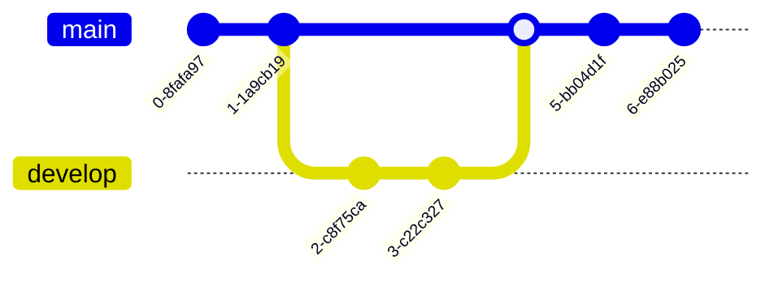

# Mermaid – Markdown‑Inspired Diagramming Library

Mermaid is a JavaScript‑based diagramming tool that turns simple, Markdown‑style text into rich, interactive diagrams.  
It is designed to keep documentation up‑to‑date while consuming minimal developer time.

---

## Table of Contents

| Section | Description |
|--------|------------|
| [Installation](#installation) | How to add Mermaid to your project |
| [Getting Started](#getting-started) | Quick example |
| [Supported Diagram Types](#supported-diagram-types) | List of diagram kinds |
| [Examples](#examples) | Full code snippets for each diagram |
| [Security](#security) | How Mermaid protects against malicious input |
| [Contributing](#contributing) | How to help |
| [License](#license) | MIT |

---

## Installation

Mermaid is available as an ESM package.  
Add it to your project with npm or yarn:

```bash
npm install mermaid@11.9.0
# or
yarn add mermaid@11.9.0
```

If you prefer a CDN, use:

```html
<script src="https://cdn.jsdelivr.net/npm/mermaid@11.9.0/dist/mermaid.min.js"></script>
```

---

## Getting Started

```js
import mermaid from 'mermaid';

mermaid.initialize({
  startOnLoad: true
});
```

Place a `<div class="mermaid">` element in your HTML and write Mermaid syntax inside it.

```html
<div class="mermaid">
  graph LR
    A[Hard] -->|Text| B(Round)
    B --> C{Decision}
    C -->|One| D[Result 1]
    C -->|Two| E[Result 2]
</div>
```

Mermaid will automatically render the diagram when the page loads.

---

## Supported Diagram Types

| Diagram | Syntax |
|--------|-------|
| Flowchart | `flowchart` |
| Sequence | `sequenceDiagram` |
| Gantt | `gantt` |
| Class | `classDiagram` |
| State | `stateDiagram-v2` |
| Pie | `pie` |
| Git Graph | `gitGraph` |
| Bar Chart (via Gantt) | `gantt` |
| User Journey | `journey` |
| C4 Context | `C4Context` |

---

## Examples

Below are full, runnable examples for each diagram type.  
Copy the code into a `<div class="mermaid">` block or use the Live Editor.

### Flowchart


### Sequence Diagram


### Gantt Chart


### Class Diagram


### State Diagram


### Pie Chart


### Git Graph



### Bar Chart (via Gantt)


### User Journey


### C4 Context Diagram


---

## Security

Mermaid sanitizes incoming diagram code to prevent malicious scripts.  
For sites that accept user‑generated diagrams, you can enable sandboxed rendering:

```js
mermaid.initialize({
  securityLevel: 'sandbox'
});
```

This renders diagrams inside a sandboxed `<iframe>`, blocking any JavaScript execution from the diagram code.

---

## Contributing

Mermaid is an open‑source project.  
If you’d like to contribute:

1. Fork the repo.
2. Create a feature branch.
3. Submit a pull request.

See the [Contribution Guide](https://github.com/mermaid-js/mermaid/blob/main/CONTRIBUTING.md) for details.

---

## License

MIT © Mermaid

---