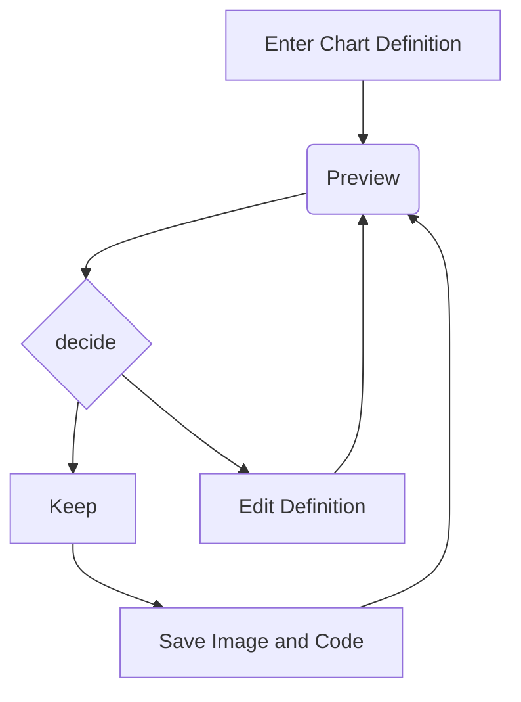
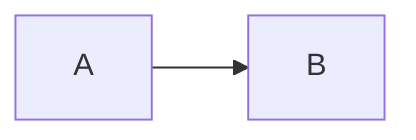

# Mermaid Documentation – Code‑Only Guide

> This document is a **sanitized, code‑centric** version of the Mermaid user guide.  
> All examples from the original text are preserved verbatim.

---

## 1. Overview

Mermaid is a JavaScript library that turns plain text into diagrams.  
It consists of:

| Part | Description |
|------|------------|
| **Deployment** | How to host Mermaid (CLI, CDN, npm) |
| **Syntax** | Diagram definition language |
| **Configuration** | Styling, themes, and options |

---

## 2. Ways to Use Mermaid

| Method | Description | Example |
|-------|------------|--------|
| **Live Editor** | Web‑based editor (`https://mermaid.live`) | See §2.1 |
| **Chart Editor** | Web‑based diagram editor (`https://mermaid.chart`) | See §2.2 |
| **Plugins** | Integrations for IDEs, Office, etc. | See §2.3 |
| **JavaScript API** | Embed in any web page | See §2.4 |
| **npm/yarn** | Install as a dependency | See §2.5 |

---

## 3. Live Editor

### 3.1 Features

| Feature | Description |
|--------|------------|
| **Diagram Code** | Edit Mermaid code → instant preview |
| **Configurations** | Panel to tweak options |
| **Editing History** | Auto‑saved every minute (last 30) |
| **Saving** | PNG, SVG, Markdown |
| **Loading Gists** | Load `code.mmd` + optional `config.json` |

### 3.2 Example



---

## 4. Chart Editor

- Web‑based editor (`https://mermaid.chart`)
- Features: AI diagramming, collaboration, storage, etc.

---

## 5. Plugins & Integrations

| Platform | Plugin |
|---------|-------|
| ChatGPT | Mermaid Chart |
| JetBrains IDE | Mermaid Chart |
| Microsoft PowerPoint | Mermaid Chart |
| Microsoft Word | Mermaid Chart |
| Visual Studio Code | Mermaid Chart |

---

## 6. Native Markdown Support

Add a Mermaid block in Markdown:

```markdown

```

---

## 7. JavaScript API

### 7.1 Basic HTML Example

```html
<body>
  <pre class="mermaid">
    graph TD
    A[Client] --> B[Load Balancer]
    B --> C[Server01]
    B --> D[Server02]
  </pre>

  <script type="module">
    import mermaid from 'https://cdn.jsdelivr.net/npm/mermaid@11/dist/mermaid.esm.min.mjs';
    mermaid.initialize({ startOnLoad: true });
  </script>
</body>
```

### 7.2 Multiple Diagrams

```html
<body>
  <pre class="mermaid">
    graph TD
    A[Client] --> B[Load Balancer]
    B --> C[Server1]
    B --> D[Server2]
  </pre>

  <pre class="mermaid">
    graph TD
    A[Client] -->|tcp_123| B
    B(Load Balancer)
    B -->|tcp_456| C[Server1]
    B -->|tcp_456| D[Server2]
  </pre>

  <script type="module">
    import mermaid from 'https://cdn.jsdelivr.net/npm/mermaid@11/dist/mermaid.esm.min.mjs';
    mermaid.initialize({ startOnLoad: true });
  </script>
</body>
```

### 7.3 Local Import

```html
<body>
  <pre class="mermaid">
    graph LR
    A --- B
    B-->C[fa:fa-ban forbidden]
    B-->D(fa:fa-spinner);
  </pre>

  <pre class="mermaid">
    graph TD
    A[Client] --> B[Load Balancer]
    B --> C[Server1]
    B --> D[Server2]
  </pre>

  <script type="module">
    import mermaid from 'The/Path/In/Your/Package/mermaid.esm.mjs';
    mermaid.initialize({ startOnLoad: true });
  </script>
</body>
```

---

## 8. Installing via npm/yarn

```bash
# Node 16+ required
npm install -g yarn
yarn add mermaid          # runtime dependency
yarn add --dev mermaid    # dev dependency
```

---

## 9. Notes

- The `<script>` tag can be placed in `<body>` (recommended) or `<head>`.
- Internet Explorer is **not** supported.
- `startOnLoad` toggles automatic rendering (`true`/`false`).

---

## 10. References

- **Mermaid Live Editor** – `https://mermaid.live`
- **Mermaid Chart** – `https://mermaid.chart`
- **Mermaid API Docs** – https://mermaid.js.org
- **Node.js & npm** – https://nodejs.org

---