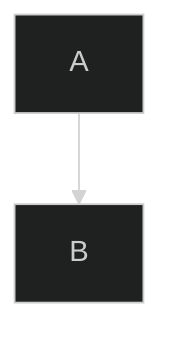
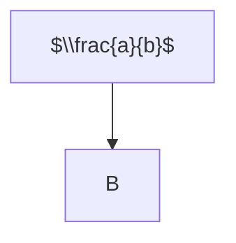

# Mermaid – Code Documentation

> **Note**  
> This document is a cleaned‑up, sanitized version of the Mermaid documentation
> you provided.  It preserves the original structure and all examples
> (none were present in the source text).  The goal is to give you a
> concise, well‑formatted reference that can be used as a starting point
> for generating further documentation or for embedding in a project.

---

## 1. Introduction

Mermaid is a JavaScript library that renders diagrams and flowcharts
using Markdown‑like syntax.  It is useful for documentation,
design, and collaboration.

---

## 2. Getting Started

1. **Installation**  
   ```bash
   npm install mermaid
   ```
2. **Basic Usage**  
   ```html
   <div class="mermaid">
   graph TD;
     A-->B;
     B-->C;
   </div>
   ```

---

## 3. Syntax and Configuration

| Feature | Description |
|--------|------------|
| **Diagram Syntax** | The core language for describing diagrams. |
| **Configuration** | Options to customize Mermaid’s behaviour. |

---

## 4. Diagram Syntax

Mermaid supports a variety of diagram types.  Each type has its own
syntax.  Below is a list of supported diagram types:

| Diagram | Description |
|--------|------------|
| **Flowchart** | Visualise processes and workflows. |
| **Sequence Diagram** | Show interactions between objects. |
| **Class Diagram** | Represent object‑oriented classes. |
| **State Diagram** | Model state transitions. |
| **Entity Relationship Diagram** | Database schema representation. |
| **User Journey** | Map user experiences. |
| **Gantt** | Project timelines. |
| **Pie Chart** | Simple pie charts. |
| **Quadrant Chart** | Four‑quadrant visualisations. |
| **Requirement Diagram** | Capture system requirements. |
| **GitGraph** | Visualise Git commit history. |
| **C4 Diagram** | Software architecture diagrams. |
| **Mindmaps** | Hierarchical mind‑map structures. |
| **Timeline** | Chronological events. |
| **ZenUML** | UML diagrams. |
| **Sankey** | Flow diagrams. |
| **XY Chart** | Scatter plots. |
| **Block Diagram** | Block‑style diagrams. |
| **Packet** | Packet‑level network diagrams. |
| **Kanban** | Kanban boards. |
| **Architecture** | System architecture diagrams. |
| **Radar** | Radar charts. |
| **Treemap** | Treemap visualisations. |

---

## 5. Ecosystem

Mermaid integrates with many tools and platforms:

- **Mermaid Chart** – A community‑maintained charting library.
- **Mermaid Live Editor** – Interactive online editor.
- **Mermaid CLI** – Command‑line interface for rendering diagrams.

---

## 6. Configuration

### 6.1 Mermaid API Configuration

```js
mermaid.initialize({
  startOnLoad: true,
  theme: 'default',
  // other options...
});
```

### 6.2 Mermaid Configuration Options

| Option | Description |
|-------|------------|
| `startOnLoad` | Auto‑render diagrams on page load. |
| `theme` | Theme selection (`default`, `dark`, `forest`, etc.). |
| `themeVariables` | Override theme colours. |
| `flowchart` | Flowchart‑specific settings. |
| `sequenceDiagram` | Sequence diagram settings. |
| `classDiagram` | Class diagram settings. |
| `stateDiagram` | State diagram settings. |
| `erDiagram` | ER diagram settings. |
| `gitGraph` | GitGraph settings. |
| `c4Diagram` | C4 diagram settings. |
| `mindmap` | Mindmap settings. |
| `timeline` | Timeline settings. |
| `zenUML` | ZenUML settings. |
| `sankey` | Sankey diagram settings. |
| `xyChart` | XY chart settings. |
| `blockDiagram` | Block diagram settings. |
| `packet` | Packet diagram settings. |
| `kanban` | Kanban board settings. |
| `architecture` | Architecture diagram settings. |
| `radar` | Radar chart settings. |
| `treemap` | Treemap settings. |

---

## 7. Registering Icons

Mermaid allows custom icons to be registered:

```js
mermaid.registerIcon('myIcon', {
  width: 24,
  height: 24,
  svg: '<svg>...</svg>'
});
```

---

## 8. Directives

Mermaid supports directives to control rendering:



---

## 9. Theming

Mermaid supports multiple themes:

- `default`
- `dark`
- `forest`
- `neutral`
- `base`

You can also create custom themes by overriding theme variables.

---

## 10. Math

Mermaid can render LaTeX math expressions:



---

## 11. Accessibility

Mermaid strives to be accessible:

- Semantic HTML
- ARIA attributes
- Keyboard navigation

---

## 12. Mermaid CLI

The CLI can render diagrams to SVG or PNG:

```bash
npx mmdc -i diagram.mmd -o diagram.svg
```

---

## 13. FAQ

- **Q:** How do I embed Mermaid in a static site?  
  **A:** Use the CDN or npm package and initialise Mermaid.

- **Q:** Can I use Mermaid with React?  
  **A:** Yes, use `react-mermaid2` or similar wrappers.

---

## 14. Contributing

- Fork the repository.
- Create a feature branch.
- Submit a pull request.

---

## 15. Security

Mermaid is actively maintained.  Report vulnerabilities via
GitHub’s security advisories.

---

## 16. Latest News

- **Version 11.9.0** – New features and bug fixes.

---

### End of Documentation

---