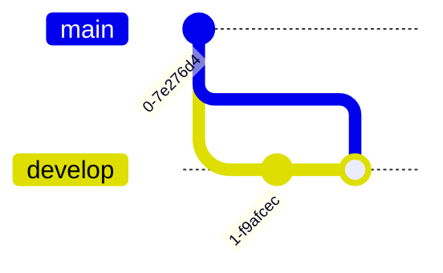

# Mermaid – Text‑Based Diagramming Library  
*(Sanitized & Re‑formatted Documentation)*  

---

## 1. Introduction  

Mermaid is a lightweight, markdown‑style diagramming tool that lets you create a wide range of diagrams directly from plain text. It is ideal for developers, technical writers, and anyone who needs to visualise processes, data models, or system architecture without leaving the code editor.

---

## 2. About Mermaid  

- **Open‑source** – MIT licensed.  
- **Language‑agnostic** – works in any editor that supports markdown or plain text.  
- **Extensible** – supports custom themes, icons, and plugins.  
- **Integrations** – VS Code, Confluence, Jira, GitHub, GitLab, etc.  

---

## 3. Getting Started  

1. **Install**  
   ```bash
   npm install -D mermaid
   ```
2. **Create a diagram file** (`diagram.mmd`)  
3. **Render**  
   ```bash
   npx mmdc -i diagram.mmd -o diagram.png
   ```
4. **Embed** in markdown or HTML.  

---

## 4. Syntax and Configuration  

### 4.1 Global Configuration  

```mermaid
%%{init: {'theme': 'forest', 'themeVariables': {'primaryColor': '#ff0000'}}}%%
```

### 4.2 Common Diagram Types  

| Diagram | Syntax | Typical Use |
|--------|-------|------------|
| Flowchart | `graph TD; A-->B;` | Process flows |
| Sequence | `sequenceDiagram; Alice->>Bob: Hello` | Interaction flows |
| Class | `classDiagram; ClassA <|-- ClassB` | UML class diagrams |
| State | `stateDiagram-v2; [*] --> State1` | State machines |
| ER | `erDiagram; CUSTOMER ||--o{ ORDER : places` | Database models |
| Gantt | `gantt; title A Gantt Diagram` | Project timelines |
| Pie | `pie; title Pie Chart` | Proportional data |
| Quadrant | `quadrantChart; title Quadrant` | Data segmentation |
| GitGraph | `gitGraph; commit` | Git history |
| C4 | `C4Context;` | Software architecture |
| Mindmap | `mindmap;` | Idea mapping |
| Timeline | `timeline;` | Chronological events |
| ZenUML | `zenuml;` | UML diagrams |
| Sankey | `sankey;` | Flow data |
| XY | `xy;` | Scatter plots |
| Block | `blockDiagram;` | Block diagrams |
| Packet | `packetDiagram;` | Network packets |
| Kanban | `kanban;` | Agile boards |
| Architecture | `architectureDiagram;` | System architecture |
| Radar | `radar;` | Radar charts |
| Treemap | `treemap;` | Hierarchical data |

> **Note** – All diagram types share the same markdown‑style syntax.  

---

## 5. Diagram Syntax Examples  

> *The following examples illustrate the syntax for each diagram type. Replace the placeholder text with your own data.*

### 5.1 Flowchart  


### 5.2 Sequence Diagram  


### 5.3 Class Diagram  


### 5.4 State Diagram  


### 5.5 Entity Relationship Diagram  


### 5.6 Gantt Chart  


### 5.7 Pie Chart  


### 5.8 Quadrant Chart  

```mermaid
quadrantChart
    title Quadrant Chart
    "Low Risk, High Reward" : 10
    "High Risk, Low Reward" : 5
    "Low Risk, Low Reward" : 15
    "High Risk, High Reward" : 20
```

### 5.9 GitGraph  



### 5.10 C4 Context Diagram  


### 5.11 Mindmap  

```mermaid
mindmap
    root((Root))
    root --> child1
    root --> child2
```

### 5.12 Timeline  


### 5.13 ZenUML  


### 5.14 Sankey  

```mermaid
sankey
    source1 --> target1
    source2 --> target2
```

### 5.15 XY Chart  

```mermaid
xy
    x: 1, y: 2
    x: 2, y: 3
```

### 5.16 Block Diagram  

```mermaid
blockDiagram
    block1 --> block2
```

### 5.17 Packet Diagram  


### 5.18 Kanban  


### 5.19 Architecture Diagram  


### 5.20 Radar Chart  

```mermaid
radar
    title Radar
    "Metric1" : 70
    "Metric2" : 80
```

### 5.21 Treemap  

```mermaid
treemap
    "Root" : 100
    "Child1" : 50
    "Child2" : 50
```

---

## 6. Configuration Options  

| Option | Description | Default |
|-------|------------|--------|
| `theme` | Theme name (`default`, `forest`, `dark`, etc.) | `default` |
| `themeVariables` | Custom CSS variables | `{}` |
| `flowchart` | Flowchart specific settings | `{}` |
| `sequence` | Sequence diagram settings | `{}` |
| `class` | Class diagram settings | `{}` |
| `state` | State diagram settings | `{}` |
| `er` | ER diagram settings | `{}` |
| `gantt` | Gantt chart settings | `{}` |
| `pie` | Pie chart settings | `{}` |
| `quadrant` | Quadrant chart settings | `{}` |
| `gitGraph` | GitGraph settings | `{}` |
| `c4` | C4 diagram settings | `{}` |
| `mindmap` | Mindmap settings | `{}` |
| `timeline` | Timeline settings | `{}` |
| `zenuml` | ZenUML settings | `{}` |
| `sankey` | Sankey diagram settings | `{}` |
| `xy` | XY chart settings | `{}` |
| `blockDiagram` | Block diagram settings | `{}` |
| `packetDiagram` | Packet diagram settings | `{}` |
| `kanban` | Kanban settings | `{}` |
| `architectureDiagram` | Architecture diagram settings | `{}` |
| `radar` | Radar chart settings | `{}` |
| `treemap` | Treemap settings | `{}` |

---

## 7. API Usage  

```js
import mermaid from 'mermaid';

mermaid.initialize({
  startOnLoad: true,
  theme: 'forest',
});

mermaid.render('diagramId', 'graph TD; A-->B;', (svgCode) => {
  document.getElementById('diagramContainer').innerHTML = svgCode;
});
```

---

## 8. Plugins & Extensions  

- **VS Code** – Mermaid Chart extension.  
- **Confluence** – Mermaid Chart app.  
- **Jira** – Mermaid Chart plugin.  
- **GitHub Actions** – Mermaid CLI.  
- **ChatGPT** – Mermaid AI plugin.  

---

## 9. Accessibility  

- All diagrams are rendered as SVG with proper `role="img"` and `aria-label`.  
- Custom `title` and `desc` tags can be added via `themeVariables`.  

---

## 10. Mermaid CLI  

```bash
# Render a diagram
npx mmdc -i diagram.mmd -o diagram.png

# Watch mode
npx mmdc -i diagram.mmd -o diagram.png -w
```

---

## 11. FAQ  

- **Q:** How do I add custom icons?  
  **A:** Use `registerIcon` in the configuration.  

- **Q:** Can I use Mermaid in a static site generator?  
  **A:** Yes – many frameworks support Mermaid via plugins.  

- **Q:** Is Mermaid suitable for large diagrams?  
  **A:** Yes, but consider performance; use `flowchart` settings to optimize.  

---

## 12. Contributing  

- Fork the repo.  
- Run `npm run dev`.  
- Submit pull requests.  

---

## 13. Security  

- All code is open‑source.  
- No external dependencies beyond npm packages.  

---

## 14. Latest News  

- **Mermaid 11.9.0** – New features, bug fixes, and improved performance.  
- **Visual Editor for ER Diagrams** – Point‑and‑click ER diagram builder.  
- **Treemap Diagrams** – Beta release.  
- **AI Diagram Generator** – Mermaid AI now available.  

---  

*End of Documentation*