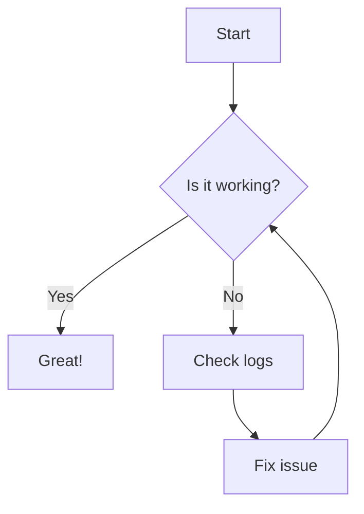

# Mermaid Chart – Developer Documentation

> **Mermaid Chart** is a diagramming tool that lets you create diagrams from plain text.  
> It is built by the team behind the award‑winning open‑source project **Mermaid JS**.

---

## 1. Overview

| Feature | Description |
|--------|------------|
| **Diagram Types** | Flowcharts, sequence diagrams, git graphs, and more |
| **Input Methods** | Text‑based syntax (Mermaid) or drag‑and‑drop visual editor |
| **AI Assistance** | Embedded AI chat that generates diagrams from natural‑language prompts |
| **Whiteboard** | Drag‑and‑drop interface that integrates Mermaid JS syntax |
| **Plugins** | ChatGPT, GitHub Copilot, Confluence, Jira, VS Code, JetBrains IDE, Google Docs, Microsoft PowerPoint & Word |
| **Enterprise** | SSO, custom integrations, on‑premise installations |

---

## 2. Getting Started

1. **Sign Up** – Create a free account on the Mermaid Chart website.  
2. **Create a Diagram** –  
   * **Text Mode** – Write Mermaid syntax in the editor.  
   * **Visual Mode** – Drag and drop shapes, add text, and customize.  
3. **AI Generation** – Use the AI chat to turn prompts into diagrams.  
4. **Export / Share** – Export to PNG, SVG, or embed in Markdown/HTML.

---

## 3. Diagram Types & Syntax

Below are the supported diagram types. Each type has its own Mermaid syntax.

| Diagram | Syntax Example |
|--------|---------------|
| **Flowchart** | `graph TD\nA[Start] --> B{Decision}\nB -->|Yes| C[Yes Path]\nB -->|No| D[No Path]` |
| **Sequence Diagram** | `sequenceDiagram\nAlice->>Bob: Hello\nBob-->>Alice: Hi!` |
| **Git Graph** | `gitGraph\ncommit\nbranch feature\ncommit\nmerge main` |

> **Tip:** Use the visual editor to see a live preview of your Mermaid code.

---

## 4. Plugins

Mermaid Chart offers integrations for popular tools:

| Platform | Integration |
|---------|------------|
| ChatGPT | `!mermaid` command |
| GitHub Copilot | Mermaid syntax suggestions |
| Confluence | Embed diagrams directly |
| Jira | Attach diagrams to tickets |
| VS Code | Mermaid preview extension |
| JetBrains IDE | Mermaid plugin |
| Google Docs | Mermaid add‑on |
| Microsoft PowerPoint & Word | Mermaid add‑on |

---

## 5. Enterprise Features

| Feature | Description |
|--------|------------|
| **SSO** | Single Sign‑On via SAML/OIDC |
| **Custom Integrations** | API hooks, webhooks, and SDKs |
| **On‑Premise** | Deploy Mermaid Chart on your own infrastructure |

---

## 6. Community & Support

| Resource | Link |
|---------|------|
| **Discord** | Join the community for help and discussion |
| **Documentation** | Full API reference and tutorials |
| **Blog** | Latest updates and use‑cases |
| **Contact** | Email support or chat |

---

## 7. FAQ Highlights

| Question | Answer |
|---------|-------|
| *What is Mermaid Chart?* | A diagramming tool that uses text to create diagrams, built by the Mermaid JS team. |
| *How does it work?* | Write Mermaid syntax or use the visual editor; AI chat can generate diagrams from prompts. |
| *Can I use it for flowcharts?* | Yes, flowcharts, sequence diagrams, git graphs, and more are supported. |
| *Is there a visual editor?* | Yes, drag‑and‑drop interface available. |
| *Do you have plugins?* | Yes, for ChatGPT, GitHub Copilot, Confluence, Jira, VS Code, JetBrains IDE, Google Docs, PowerPoint, Word, etc. |
| *Is there an Enterprise tier?* | Yes, includes SSO, custom integrations, on‑premise installations. |

---

## 8. Quick Start Example

Paste the above into the Mermaid Chart editor to see a live diagram.

---

**© 2025 Mermaid Chart** – All rights reserved.