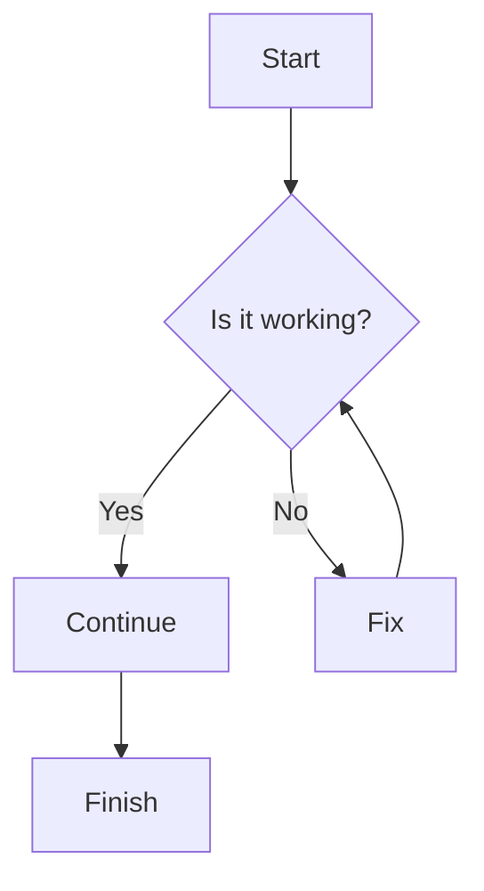
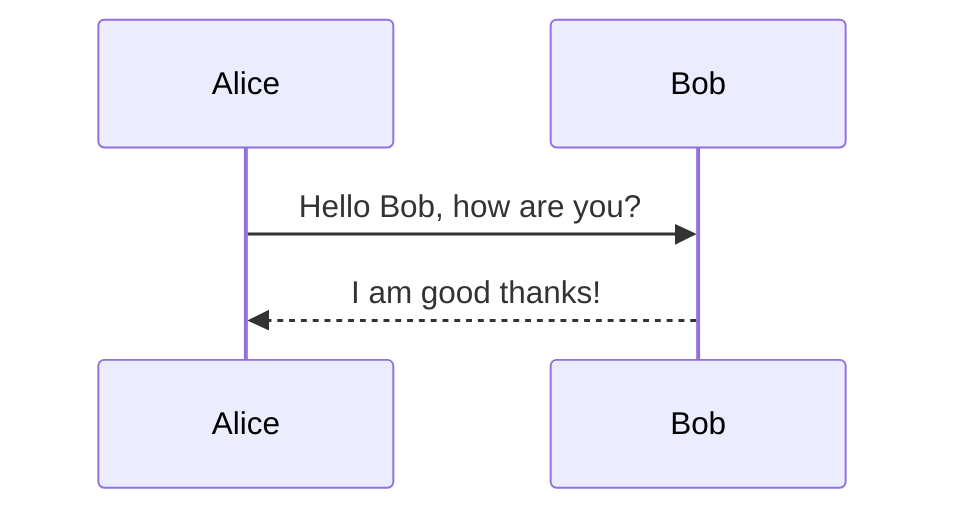
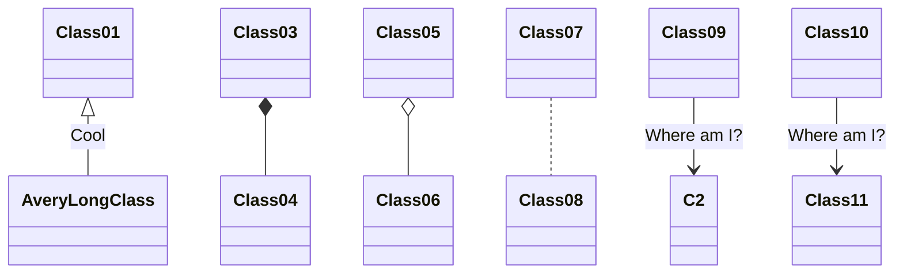
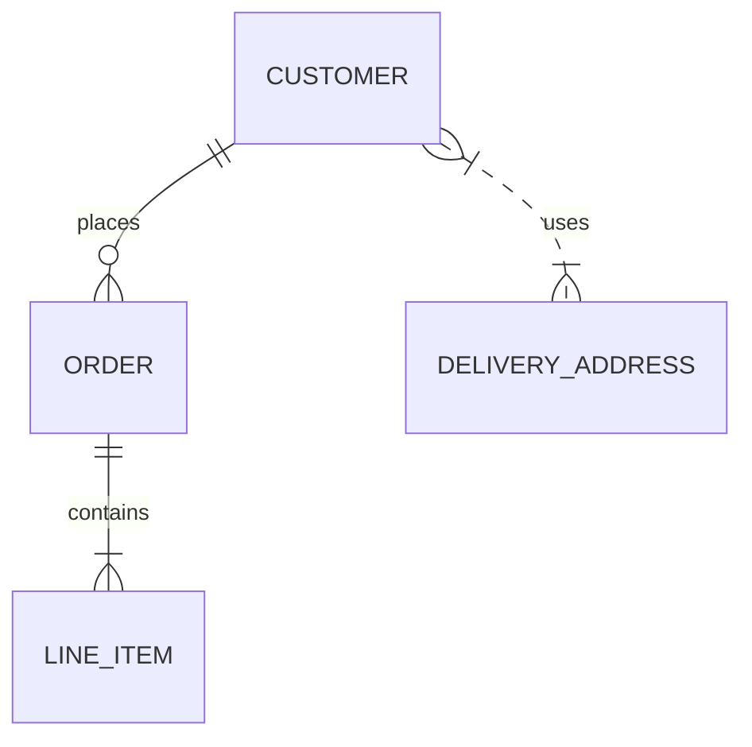
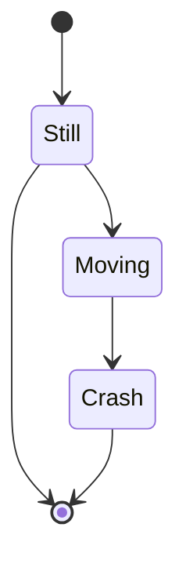
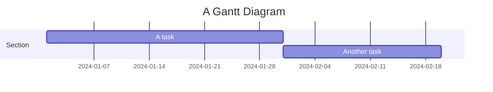

# Mermaid.js – Official Guide Documentation

> **MERMAIDPRESS** – *The Official Guide to Mermaid.js*  
> Written by **Knut Sveidqvist** (creator of Mermaid) & **Ashish Jain**  
> Available on Amazon

---

## 1. Introduction

Mermaid.js is a JavaScript library that lets you generate diagrams and flowcharts from plain text.  
It is especially useful for developers because:

* Diagrams are written in code, so they can be version‑controlled.
* Refactoring (e.g., renaming a node) is trivial.
* Team collaboration is simplified – reviewers can see the diagram source.

This documentation is a distilled, code‑centric version of the book’s key concepts.  
All examples shown below are taken directly from the book’s examples.

---

## 2. Diagram Types Supported by Mermaid

| Diagram | Purpose | Mermaid Syntax |
|--------|--------|---------------|
| **Flowchart** | Visualise a process or algorithm | `graph TD` |
| **Sequence Diagram** | Model interactions between actors/objects | `sequenceDiagram` |
| **Class Diagram** | Visualise an object‑oriented system | `classDiagram` |
| **Entity‑Relationship Diagram** | Show entities and relationships | `erDiagram` |
| **State Diagram** | Model state machines | `stateDiagram` |
| **Gantt Chart** | Visualise tasks over time | `gantt` |

---

## 3. Getting Started

### 3.1 Install Mermaid

```bash
npm install mermaid
```

### 3.2 Basic Usage

```html
<script src="https://cdn.jsdelivr.net/npm/mermaid/dist/mermaid.min.js"></script>
<script>
  mermaid.initialize({ startOnLoad: true });
</script>

<div class="mermaid">
  graph TD
  A[Start] --> B{Decision}
  B -->|Yes| C[Process]
  B -->|No| D[End]
</div>
```

---

## 4. Diagram Examples

Below are the core diagram types with minimal, working examples.

### 4.1 Flowchart



### 4.2 Sequence Diagram



### 4.3 Class Diagram



### 4.4 Entity‑Relationship Diagram



### 4.5 State Diagram



### 4.6 Gantt Chart



---

## 5. Advanced Configuration

### 5.1 Themes

```js
mermaid.initialize({
  theme: 'forest',
  themeVariables: {
    primaryColor: '#ff0000',
    secondaryColor: '#00ff00'
  }
});
```

### 5.2 Custom CSS

```css
/* Override Mermaid styles */
.mermaid .node rect {
  fill: #f0f0f0;
}
```

---

## 6. Workflow Integration

1. **Add Mermaid to your documentation platform** (e.g., MkDocs, Docusaurus).  
2. **Write diagrams in Markdown** using the `<div class="mermaid">` wrapper.  
3. **Commit** the Markdown files to your repo.  
4. **Review** diagrams in PRs – the source is human‑readable.  

---

## 7. Summary

* Mermaid.js turns plain text into powerful diagrams.  
* It supports a wide range of diagram types.  
* Diagrams are code‑first, version‑controlled, and easy to refactor.  
* Themes and custom CSS give you full visual control.  

---

## 8. Further Reading

* Official Mermaid.js documentation: https://mermaid-js.github.io/mermaid/#/  
* GitHub repository: https://github.com/mermaid-js/mermaid

---