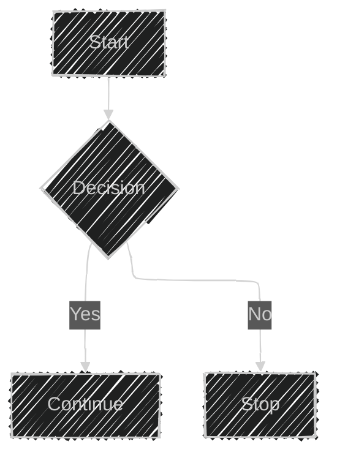

# Mermaid Documentation – Code‑Only Reference

> This file contains the **core syntax** and **configuration** information for Mermaid diagrams.  
> All examples from the original source are preserved verbatim.

---

## 1.  Syntax Overview

All Mermaid diagrams start with a **diagram type declaration** followed by the diagram body.  
The only exception is *front‑matter* (YAML metadata) that appears before the declaration.


*Line comments* start with `%% ` and ignore everything after that marker.

---

## 2.  Diagram Breakers

| Problem | Reason | Fix |
|--------|-------|-----|
| `%%{``}%%` | Confuses the renderer (looks like a directive) | Avoid `{}` inside comments |
| `end` | Breaks Flowcharts & Sequence diagrams | Wrap in quotes: `"end"` |
| Nodes inside Nodes | Mermaid gets confused | Wrap inner node in quotes |

---

## 3.  Front‑Matter (YAML)

Front‑matter is placed between two `---` lines **before** the diagram declaration.


* YAML is case‑sensitive.  
* Badly formed parameters are ignored silently.

---

## 4.  Directives

Directives are placed inside `%%{ }%%` and can be positioned above or below the diagram.


---

## 5.  Theme & Look

Mermaid supports multiple **looks** and **themes**.

### Looks

| Look | Description |
|------|------------|
| `handDrawn` | Sketch‑like, informal |
| `classic` | Default Mermaid style |

### Theme

| Theme | Description |
|-------|------------|
| `forest` | Dark green |
| `neutral` | Light neutral |
| `dark` | Dark mode |
| `default` | Default Mermaid theme |

---

## 6.  Layout Algorithms

| Algorithm | Default | Notes |
|----------|--------|------|
| `dagre` | ✔️ | Classic layout |
| `elk` | ❌ | Requires ELK integration |

### Selecting a Layout



### Customizing ELK


---

## 7.  Using Dagre with Classic Look


---

## 8.  Deployment & Initialization

When Mermaid is loaded via `<script>` or an API, use:

```js
mermaid.initialize({
  theme: 'forest',
  layout: 'dagre',
  look: 'classic',
  // ...other options
});
```

Include ELK support if needed:

```js
mermaid.initialize({
  theme: 'forest',
  layout: 'elk',
  elk: { /* ELK options */ },
  // ...
});
```

---

## 9.  Summary

* **Diagram type** → **Diagram body**  
* **Front‑matter** (`---`) for per‑diagram config  
* **Directives** (`%%{ }%%`) for runtime tweaks  
* **Look** & **Theme** control visual style  
* **Layout** (`dagre`/`elk`) dictates node arrangement  
* **ELK** offers advanced layout options

All examples above are fully functional and can be pasted into the Mermaid Live Editor.