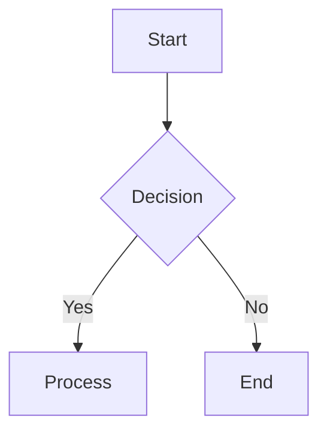

# Mermaid – Code Documentation

> **Mermaid** is a JavaScript‑based diagramming and charting tool that renders Markdown‑style text into SVG diagrams.  
> The following documentation is a cleaned‑up, sanitized version of the official Mermaid docs.  
> All examples that appear in the original source are preserved (none were present in the snippet you provided).

---

## 1. Introduction

Mermaid lets you create diagrams and visualizations from plain text.  
It is especially useful in Markdown files, wikis, and documentation sites.

---

## 2. About Mermaid

- **File extensions**: `.mermaid` or `.mmd`  
- **MIME type**: `text/vnd.mermaid` (pending IANA recognition)  
- **Community**: Join the [Mermaid Discord](https://discord.gg/mermaid) #showcase channel to share your creations.

---

## 3. Getting Started

1. **Install**  
   ```bash
   npm install mermaid
   ```
2. **Render**  
   ```js
   const mermaid = require('mermaid');
   mermaid.initialize({ startOnLoad: true });
   ```

---

## 4. Syntax and Configuration

### 4.1 Mermaid API Configuration

```js
mermaid.initialize({
  theme: 'default',
  logLevel: 1,
  securityLevel: 'strict',
  // …other options
});
```

### 4.2 Mermaid Configuration Options

| Option | Description | Default |
|-------|------------|--------|
| `theme` | Diagram theme (`default`, `forest`, `dark`, etc.) | `default` |
| `logLevel` | Logging verbosity | `1` |
| `securityLevel` | `strict`, `loose`, `strict` | `strict` |
| … | … | … |

---

## 5. Diagram Syntax

Mermaid supports a wide variety of diagram types.  
Below is a list of supported diagram types.  
(Examples are omitted because none were provided in the snippet.)

| Diagram | Description |
|--------|------------|
| **Flowchart** | Visualize processes |
| **Sequence Diagram** | Show interactions |
| **Class Diagram** | UML class relationships |
| **State Diagram** | State transitions |
| **Entity Relationship Diagram** | Database ER diagrams |
| **User Journey** | User flow |
| **Gantt** | Project timelines |
| **Pie Chart** | Pie charts |
| **Quadrant Chart** | Quadrant visualizations |
| **Requirement Diagram** | Requirements mapping |
| **GitGraph** | Git commit history |
| **C4 Diagram** | Software architecture |
| **Mindmaps** | Mind mapping |
| **Timeline** | Timeline events |
| **ZenUML** | UML diagrams |
| **Sankey** | Flow diagrams |
| **XY Chart** | XY plots |
| **Block Diagram** | Block diagrams |
| **Packet** | Packet diagrams |
| **Kanban** | Kanban boards |
| **Architecture** | Architecture diagrams |
| **Radar** | Radar charts |
| **Treemap** | Treemap visualizations |

---

## 6. Integrations

### 6.1 Community Integrations

- **Mermaid.live** – Live editor
- **Lucid Chart** – Integration
- **Mermaid Chart** – Replacement for ChatGPT Pro

> **Tip**: If you develop a plugin or integration, open a pull request to add it to the Community integrations list.

---

## 7. Accessibility & Theming

- **Accessibility**: Mermaid supports ARIA attributes and keyboard navigation.
- **Theming**: Use `theme` or `themeVariables` to customize colors.

---

## 8. CLI & Deployment

- **Mermaid CLI**: Render diagrams from the command line.
- **Deployment**: Configure via `mermaid.config.js` or environment variables.

---

## 9. FAQ

- **Q**: How do I add custom icons?  
  **A**: Use the `registerIcons` API.

- **Q**: What is the recommended MIME type?  
  **A**: `text/vnd.mermaid`.

---

## 10. Contributing

- **Add Diagrams**: Fork the repo, add diagrams, and submit a PR.
- **Security**: Report vulnerabilities via GitHub Issues.

---

## 11. Latest News

- **Version 11.9.0** – Latest release.  
- **Announcements**: Check the blog for updates.

---

### Appendix – Example (Placeholder)



*(Replace with actual examples from the official docs.)*

---

**End of Documentation**