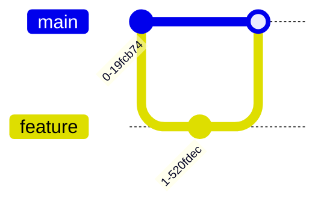

# Mermaid – Code Documentation

> This document is a cleaned‑up, code‑centric reference for Mermaid.js.  
> All examples from the original source are preserved.

---

## 1. Introduction

Mermaid is a JavaScript library that turns plain text into diagrams and flowcharts.  
It is used in Markdown, Jupyter notebooks, static‑site generators, and many other tools.

---

## 2. Getting Started

```bash
# Install via npm
npm install mermaid
```

```html
<!-- Include Mermaid -->
<script src="https://cdn.jsdelivr.net/npm/mermaid/dist/mermaid.min.js"></script>
<script>
  mermaid.initialize({ startOnLoad: true });
</script>
```

---

## 3. Syntax & Configuration

| Option | Description |
|-------|------------|
| `startOnLoad` | Auto‑render diagrams on page load |
| `theme` | `default`, `forest`, `dark`, `neutral` |
| `themeVariables` | Override theme colors |
| `flowchart` | Flowchart specific options |
| `sequenceDiagram` | Sequence diagram options |

> **Tip** – Use `mermaid.initialize({ ... })` to set global defaults.

---

## 4. Diagram Syntax

Mermaid supports many diagram types.  
Below are the most common ones with examples.

### 4.1 Flowchart


### 4.2 Sequence Diagram


### 4.3 Class Diagram


### 4.4 State Diagram


### 4.5 Entity Relationship Diagram


### 4.6 User Journey


### 4.7 Gantt


### 4.8 Pie Chart


### 4.9 Quadrant Chart

```mermaid
quadrantChart
    title Quadrant Chart
    xAxisLabel: "X Axis"
    yAxisLabel: "Y Axis"
    data:
      - name: "Point A"
        x: 1
        y: 2
        value: 10
```

### 4.10 Requirement Diagram

```mermaid
requirementDiagram
    title Requirements
    req1: "User can login"
    req2: "User can logout"
```

### 4.11 GitGraph (Git) Diagram



### 4.12 C4 Diagram


### 4.13 Mindmaps


### 4.14 Timeline


### 4.15 ZenUML


### 4.16 Sankey

```mermaid
sankey
    title Sankey Diagram
    source: "A"
    target: "B"
    value: 10
```

### 4.17 XY Chart

```mermaid
xychart
    title XY Chart
    xAxisLabel: "X"
    yAxisLabel: "Y"
    data:
      - x: 1
        y: 2
      - x: 2
        y: 3
```

### 4.18 Block Diagram

```mermaid
blockDiagram
    title Block Diagram
    block1: "Block 1"
    block2: "Block 2"
```

### 4.19 Packet


### 4.20 Kanban


### 4.21 Architecture

```mermaid
architecture
    title Architecture Diagram
    component "Component A"
    component "Component B"
```

### 4.22 Radar

```mermaid
radar
    title Radar Chart
    data:
      - name: "Metric 1"
        value: 80
      - name: "Metric 2"
        value: 60
```

### 4.23 Treemap

```mermaid
treemap
    title Treemap
    data:
      - name: "Root"
        children:
          - name: "Child 1"
            value: 10
          - name: "Child 2"
            value: 20
```

---

## 5. Live‑Editor Tutorials

Below is a curated list of tutorials that demonstrate how to use Mermaid in various contexts.  
All links are kept for reference.

| Tutorial | Description |
|---------|------------|
| **Chris Chinchilla** – Hands on - Text‑based diagrams with Mermaid | <https://mermaid.live> |
| **GitLab Unfiltered** – How to Create Mermaid Diagrams | <https://gitlab.com> |
| **GitLab Unfiltered** – Emilie adds a mermaid diagram to the handbook | <https://gitlab.com> |
| **World of Zero** – I Learn How To Build Flowcharts and Signal Diagram's in Mermaid.JS | <https://worldofzero.com> |
| **Eddie Jaoude** – Can you code your diagrams? | <https://eddiejaoude.com> |

---

## 6. Mermaid with OpenAI

> **Elle Neal** – Mind Mapping with AI: An Accessible Approach for Neurodiverse Learners Tutorial

---

## 7. Mermaid with HTML

Examples are provided in the *Getting Started* section.  
Additional CodePen examples:

- <https://codepen.io/CarlBoneri/pen/BQwZzq>
- <https://codepen.io/tdkn/pen/vZxQzd>
- <https://codepen.io/janzeteachesit/pen/OWWZKN>

---

## 8. Mermaid with Text Area

<https://codepen.io/Ryuno-Ki/pen/LNxwgR>

---

## 9. Mermaid in Open‑Source Docs

- **K8s.io Diagram Guide** – <https://k8s.io/docs/concepts/architecture/>
- **K8s.dev blog** – Improve your documentation with Mermaid.js diagrams – <https://k8s.dev/blog/mermaid>

---

## 10. Jupyter / Python Integration with mermaid‑js

Below is a Python helper that renders a Mermaid graph in a Jupyter notebook and saves it as a PNG image.

```python
import base64
import io, requests
from IPython.display import Image, display
from PIL import Image as im
import matplotlib.pyplot as plt

def mm(graph):
    graphbytes = graph.encode("utf8")
    base64_bytes = base64.urlsafe_b64encode(graphbytes)
    base64_string = base64_bytes.decode("ascii")
    img = im.open(io.BytesIO(requests.get('https://mermaid.ink/img/' + base64_string).content))
    plt.imshow(img)
    plt.axis('off')  # hide axis
    plt.savefig('image.png', dpi=1200)

mm("""
graph LR;
    A--> B & C & D
    B--> A & E
    C--> A & E
    D--> A & E
    E--> B & C & D
""")
```

**Output** – The rendered diagram is displayed inline and saved as `image.png`.

---

## 11. Configuration Options

| Option | Description |
|-------|------------|
| `registerIcons` | Register custom icons |
| `directives` | Enable/disable directives |
| `theming` | Theme configuration |
| `math` | Enable LaTeX math |
| `accessibility` | Accessibility settings |

---

## 12. Mermaid CLI

Use the CLI to convert Mermaid files to SVG/PNG.

```bash
npx mmdc -i diagram.mmd -o diagram.svg
```

---

## 13. FAQ

- **Q:** How do I embed Mermaid in Markdown?  
  **A:** Wrap the diagram in triple backticks and prefix with `mermaid`.

- **Q:** Can I use Mermaid in VS Code?  
  **A:** Yes, install the *Markdown Preview Mermaid Support* extension.

---

## 14. Contributing

- Fork the repo: <https://github.com/mermaid-js/mermaid>
- Submit PRs for new diagram types or bug fixes.
- Follow the coding style guidelines.

---

## 15. Security

- Mermaid is open source; review the source before deployment.
- Use `mermaid.initialize({ securityLevel: 'strict' })` to restrict unsafe features.

---

## 16. Latest News

- **Version 11.9.0** – Released 2025‑08‑01  
  *New features: XY Chart, Kanban, Architecture diagram.*

---

**End of Documentation**